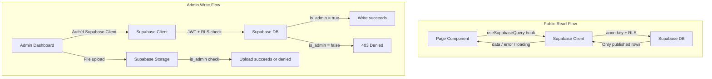

# Supabase-Backed Content System for WSC Website

## Current State

- **Stack:** Vite + React 19, React Router v6, Tailwind CSS + custom CSS
- **Data:** Static JSON files in `[wsc-vite-app/data/](wsc-vite-app/data/)` -- `EventData.json`, `SponsorData.json`, `TeamData.json`, `aboutData.json`
- **Images:** Local files in `data/headshots/`, `data/sponsor-logos/`, and `public/`
- **Auth:** None. No Supabase installed. Firebase dependency exists but is unused.
- **Styling:** Hybrid Tailwind + custom CSS with CSS variables (`--wsc-gold`, `--wsc-purple`, `--wsc-dark`, `--wsc-light`)
- **Existing components to reuse:** `LazyImage` (IntersectionObserver lazy loading), `PageTitle`

---

## Pre-Task: About Page Gallery UI

### Data Shape (placeholder, will later come from Supabase)

```js
// Gallery photo object shape
{
  id: string,
  src: string,          // URL (later: Supabase Storage public URL)
  alt: string,          // accessibility text
  caption: string | null,
  display_order: number
}
```

### UI States


| State       | Behavior                                                           |
| ----------- | ------------------------------------------------------------------ |
| **Loading** | Skeleton grid (pulsing placeholder cards matching the grid layout) |
| **Empty**   | Friendly message: "No photos yet -- check back soon!"              |
| **Error**   | "Couldn't load photos" + Retry button                              |
| **Success** | Responsive image grid                                              |


### Implementation Approach

- Add a new `<GallerySection>` below the Values section in `[About.jsx](wsc-vite-app/src/pages/About/About.jsx)`
- Create a `GallerySection` component that accepts `{ photos, loading, error, onRetry }` props
- Responsive grid: 1 col mobile, 2 cols tablet, 3 cols desktop (CSS grid in `About.css`)
- Each image uses the existing `LazyImage` component
- Optional lightbox on click (stretch -- can defer)
- For now, wire to a local `useState` with empty array (simulates "empty" state) to verify all states render correctly. Add a `MOCK_GALLERY_DATA` constant for dev testing.

### Files to Change

- `[wsc-vite-app/src/pages/About/About.jsx](wsc-vite-app/src/pages/About/About.jsx)` -- add gallery section after Values
- `[wsc-vite-app/src/pages/About/About.css](wsc-vite-app/src/pages/About/About.css)` -- add gallery grid styles
- New: `wsc-vite-app/src/components/GallerySection.jsx` -- reusable gallery component

---

## Main Task: Supabase Backend

### 1. Supabase Schema

#### `admins` -- allowlist table

```sql
CREATE TABLE admins (
  id UUID PRIMARY KEY DEFAULT gen_random_uuid(),
  email TEXT UNIQUE NOT NULL,
  created_at TIMESTAMPTZ DEFAULT now()
);
-- Seed with the single club email
INSERT INTO admins (email) VALUES ('club-email@gmail.com');
```

#### `events`

```sql
CREATE TABLE events (
  id UUID PRIMARY KEY DEFAULT gen_random_uuid(),
  title TEXT NOT NULL,
  date DATE NOT NULL,
  time TEXT,
  location TEXT,
  description TEXT,
  image_url TEXT,              -- optional event image from Storage
  published BOOLEAN DEFAULT false,
  display_order INT DEFAULT 0,
  created_at TIMESTAMPTZ DEFAULT now(),
  updated_at TIMESTAMPTZ DEFAULT now()
);
```

Maps from current `[EventData.json](wsc-vite-app/data/EventData.json)` fields: `title`, `date`, `time`, `location`, `description`. Adds: `image_url`, `published`, `display_order`.

#### `sponsors`

```sql
CREATE TABLE sponsors (
  id UUID PRIMARY KEY DEFAULT gen_random_uuid(),
  name TEXT NOT NULL,
  description TEXT,
  logo_url TEXT,               -- from Storage bucket
  link TEXT,
  active BOOLEAN DEFAULT false,
  display_order INT DEFAULT 0,
  created_at TIMESTAMPTZ DEFAULT now(),
  updated_at TIMESTAMPTZ DEFAULT now()
);
```

Maps from current `[SponsorData.json](wsc-vite-app/data/SponsorData.json)`: `name`, `description`, `logoFileName` -> `logo_url`, `link`. Adds: `active`, `display_order`.

#### `executives` -- single table, grouped by `group` field

```sql
CREATE TABLE executives (
  id UUID PRIMARY KEY DEFAULT gen_random_uuid(),
  name TEXT NOT NULL,
  title TEXT NOT NULL,
  "group" TEXT NOT NULL CHECK ("group" IN ('president', 'vice_president', 'assistant_vice_president')),
  headshot_url TEXT,           -- from Storage bucket
  visible BOOLEAN DEFAULT false,
  display_order INT DEFAULT 0,
  created_at TIMESTAMPTZ DEFAULT now(),
  updated_at TIMESTAMPTZ DEFAULT now()
);
```

Flattens the nested structure in `[TeamData.json](wsc-vite-app/data/TeamData.json)` into one table. The `group` field replaces the three separate arrays.

#### `gallery_photos`

```sql
CREATE TABLE gallery_photos (
  id UUID PRIMARY KEY DEFAULT gen_random_uuid(),
  image_url TEXT NOT NULL,     -- from Storage bucket
  alt TEXT DEFAULT '',
  caption TEXT,
  visible BOOLEAN DEFAULT false,
  display_order INT DEFAULT 0,
  created_at TIMESTAMPTZ DEFAULT now()
);
```

### 2. Storage Buckets


| Bucket          | Purpose                   | Public read | Admin-only write |
| --------------- | ------------------------- | ----------- | ---------------- |
| `headshots`     | Executive headshot images | Yes         | Yes              |
| `sponsor-logos` | Sponsor logo images       | Yes         | Yes              |
| `event-images`  | Event banner/promo images | Yes         | Yes              |
| `gallery`       | About page gallery photos | Yes         | Yes              |


All buckets: public read via Supabase Storage CDN URLs, upload/delete restricted to authenticated admin only.

### 3. RLS + Storage Policy Strategy

#### Helper function (avoids repeating the admin check)

```sql
CREATE OR REPLACE FUNCTION is_admin()
RETURNS BOOLEAN AS $$
  SELECT EXISTS (
    SELECT 1 FROM admins
    WHERE email = auth.jwt() ->> 'email'
  );
$$ LANGUAGE sql SECURITY DEFINER STABLE;
```

#### RLS on every content table (`events`, `sponsors`, `executives`, `gallery_photos`)

```sql
ALTER TABLE events ENABLE ROW LEVEL SECURITY;

-- Public read: only published rows
CREATE POLICY "Public can read published events"
  ON events FOR SELECT
  USING (published = true);

-- Admin full access
CREATE POLICY "Admins can do anything"
  ON events FOR ALL
  USING (is_admin())
  WITH CHECK (is_admin());
```

Same pattern for `sponsors` (using `active`), `executives` (using `visible`), `gallery_photos` (using `visible`).

#### RLS on `admins` table itself

```sql
ALTER TABLE admins ENABLE ROW LEVEL SECURITY;
-- No public access. Only service role (migrations) can modify.
-- Admins can read their own row to verify status.
CREATE POLICY "Admins can read own row"
  ON admins FOR SELECT
  USING (email = auth.jwt() ->> 'email');
```

#### Storage policies (per bucket)

```sql
-- Public read (applied to each bucket)
CREATE POLICY "Public read"
  ON storage.objects FOR SELECT
  USING (bucket_id = 'headshots');

-- Admin upload
CREATE POLICY "Admin upload"
  ON storage.objects FOR INSERT
  WITH CHECK (bucket_id = 'headshots' AND is_admin());

-- Admin delete
CREATE POLICY "Admin delete"
  ON storage.objects FOR DELETE
  USING (bucket_id = 'headshots' AND is_admin());

-- Admin update (replace)
CREATE POLICY "Admin update"
  ON storage.objects FOR UPDATE
  USING (bucket_id = 'headshots' AND is_admin());
```

Repeat for each of the 4 buckets.

**Security guarantee:** The `is_admin()` function checks `auth.jwt() ->> 'email'` against the `admins` table. Since RLS is enforced at the database level, even if the frontend is compromised, writes are impossible without a valid JWT from the single authorized Google account. The service role key is never exposed to the frontend.

### 4. Auth Flow

- **Provider:** Google OAuth via Supabase Auth (`supabase.auth.signInWithOAuth({ provider: 'google' })`)
- **Admin login page:** `/admin` route shows a "Sign in with Google" button
- **Post-login check:** After OAuth redirect, query `admins` table for current user's email. If no row found -> show "Not authorized" and sign out. If found -> render admin dashboard.
- **Session:** Supabase handles JWT refresh automatically via `onAuthStateChange`.
- **Logout:** Clear session, redirect to home.

### 5. Data-Flow Architecture




#### Public Read (all content pages)

1. Custom hook (e.g., `useSupabaseQuery`) wraps `supabase.from(table).select()` with `loading`, `data`, `error` states
2. Uses the **anon key** only (safe to expose)
3. RLS ensures only `published/active/visible = true` rows are returned
4. Components receive `{ data, loading, error, refetch }` and render appropriate states

#### Admin Write (dashboard)

1. Admin authenticates via Google OAuth -> JWT stored in Supabase client
2. All mutations (insert, update, delete) go through the same Supabase client, now carrying the admin JWT
3. RLS `is_admin()` check happens server-side on every write
4. Image uploads go to Storage buckets; the returned public URL is saved to the corresponding row's URL column

### 6. Admin Dashboard

- **Route:** `/admin` (add to `[App.jsx](wsc-vite-app/src/App.jsx)`)
- **Layout:** Sidebar or tab navigation with sections: Events, Sponsors, Executives, Gallery
- **Per section:**
  - List view with toggle switches for published/active/visible
  - "Add new" button -> inline form or modal
  - Edit button per row -> same form, pre-filled
  - Delete button with confirmation
  - Drag-to-reorder or up/down arrows for `display_order`
  - Image upload button that uploads to the correct Storage bucket and writes the URL to the row
- **Auth guard:** `ProtectedRoute` wrapper component that checks auth state; redirects to login if unauthenticated, shows "Not authorized" if authenticated but not admin

### 7. Error Handling Strategy

Create a centralized error handling layer:

- `**useSupabaseQuery(table, query, options)` hook** -- wraps all reads with try/catch, returns `{ data, loading, error, refetch }`
- `**useSupabaseMutation()` hook** -- wraps all writes/uploads with try/catch, returns `{ mutate, loading, error }`
- `**<ErrorBoundary>` component** -- catches React render errors, shows fallback UI
- `**<AsyncStateWrapper>` component** -- takes `{ loading, error, data, onRetry, emptyMessage }` and renders the correct state (skeleton / error+retry / empty / children)

Applied consistently:

- **Auth failures:** `onAuthStateChange` listener detects session expiry -> redirect to login with "Session expired" toast
- **Fetch failures:** `AsyncStateWrapper` shows error message + retry button
- **Upload failures:** Inline error message on the upload field + retry
- **Partial data:** `.filter(Boolean)` and null-safe accessors before rendering; skip malformed rows
- **Missing fields:** Default values in the DB schema + frontend fallbacks (`item.title ?? 'Untitled'`)

### 8. New Dependencies

```bash
npm install @supabase/supabase-js
```

Remove unused `firebase` dependency.

### 9. Environment Variables

Add to `.env` (gitignored):

```
VITE_SUPABASE_URL=https://your-project.supabase.co
VITE_SUPABASE_ANON_KEY=your-anon-key
```

Never add the service role key. Create a `supabaseClient.js` utility:

```js
import { createClient } from '@supabase/supabase-js'
export const supabase = createClient(
  import.meta.env.VITE_SUPABASE_URL,
  import.meta.env.VITE_SUPABASE_ANON_KEY
)
```

### 10. Implementation Best Practices Checklist

- **No service role key in frontend** -- only anon key via `VITE_SUPABASE_ANON_KEY`
- **RLS on every table** -- no table without `ENABLE ROW LEVEL SECURITY`
- `**is_admin()` as SECURITY DEFINER** -- prevents users from reading the admins table to craft attacks
- **Storage policies mirror RLS** -- public read, admin-only write per bucket
- **All async ops wrapped in try/catch** -- via centralized hooks
- **Every UI has loading/error/empty states** -- via `AsyncStateWrapper`
- **No uncaught promise rejections** -- `.catch()` on every Supabase call
- **Graceful degradation** -- if Supabase is down, public pages show "temporarily unavailable" not a blank screen
- **Auth state listener** -- `onAuthStateChange` for session management
- **Optimistic UI** -- toggle switches update instantly, revert on error
- **Image upload validation** -- check file type/size client-side before uploading
- `**updated_at` trigger** -- Supabase trigger to auto-update `updated_at` on row change

